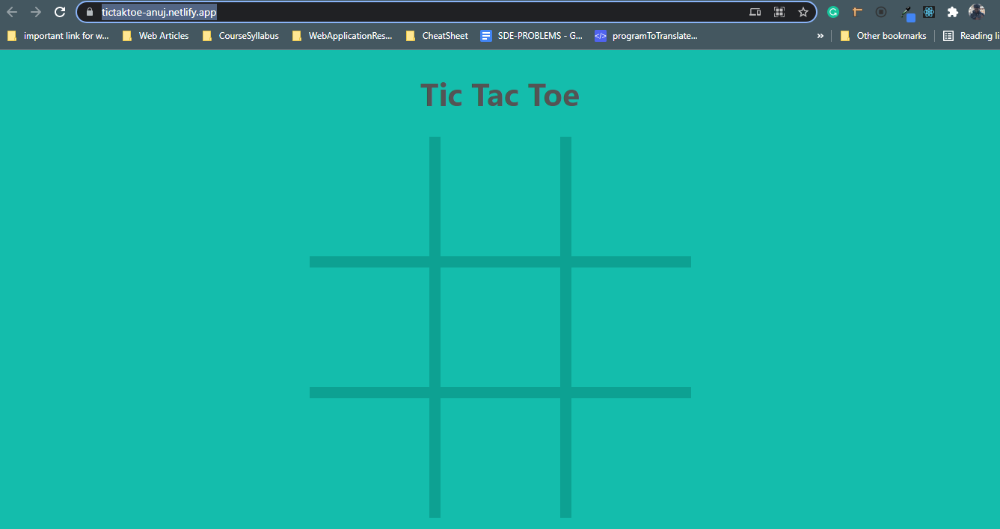
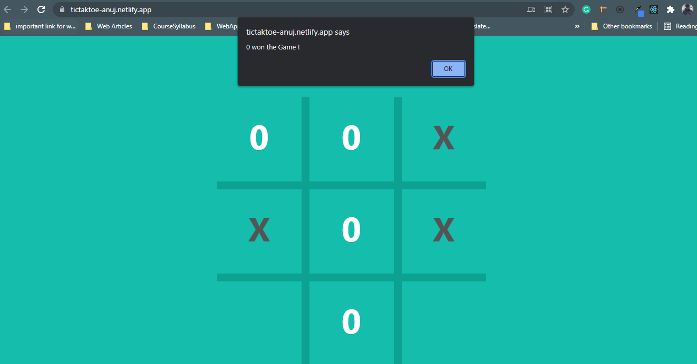

<h2>Tic-Tac-Toe</h2>
In the project directory, I have made a game called tic-tac-toe

<hr/>
<h3>Tool-kit & Technologies Used</h3>

* React
* JavaScript
* React Redux
* React Router Dom
* react-dom
* react-redux
* react-router-dom
* react-scripts


<hr/>

### Live Link : https://tictaktoe-anuj.netlify.app/

#### Tesla Pages


<hr/>

<hr/>


## Installation and Setup Instructions

## Install basic Software:
* Install NodeJS
* Install VS Code
* Install Git

Clone down this repository using this <a href="https://github.com/Anujsharma2590/tic-tac-toe-react">link</a>

You will need node and npm installed globally on your machine. 

Inside Client install with npm


```bash
  npm install
```

To Run Test Suite: npm test To Start Server: npm start

To Visit App: localhost:3000/****

